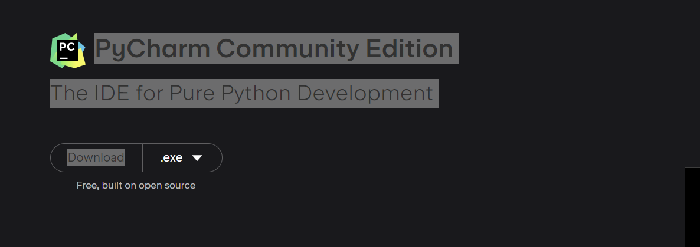
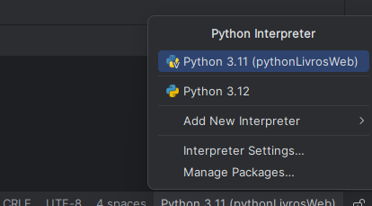

## Primeiro: 

1º Precisa baixar o PyCharm Community Edition:
- [PyCharm Community](https://www.jetbrains.com/pycharm/download/?section=windows#section=windows): Basta descer a página para localizar o executável do Community

2º Ler a documentação do Python de acordo com a versão utilizada no projeto e Flask:  
 - [Python](https://docs.python.org/3/)

 - [Flask](https://flask.palletsprojects.com/en/3.0.x/)

## Para Rodar o projeto:

1º Baixar do github

2º Rodar o projeto no PyCharm

3º Verificar se o Interprete está ok para evitar erros:

4º Instalar a biblioteca do Flask digitando o comando no terminal do PyCharm após abrir o projeto: *pip install flask*

5º Rodar o arquivo py e se divertir testando as rotas e a interação do Python com o HTML.

